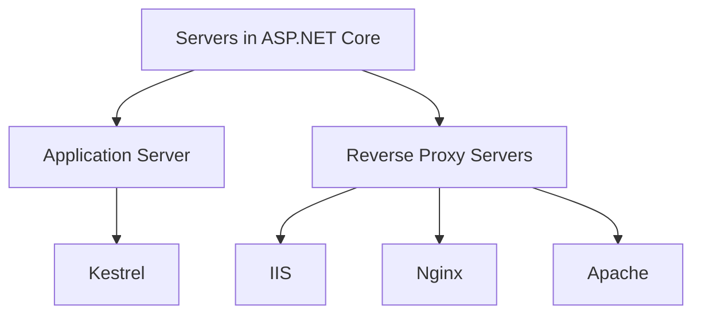
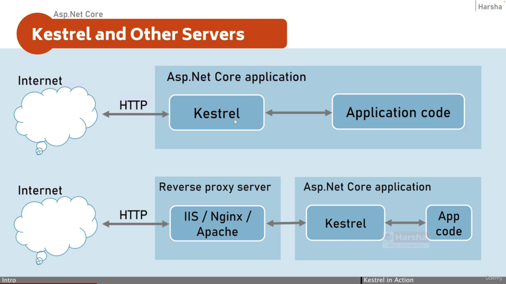
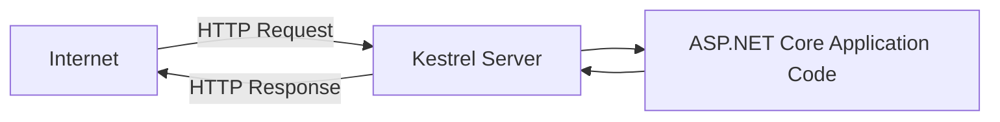
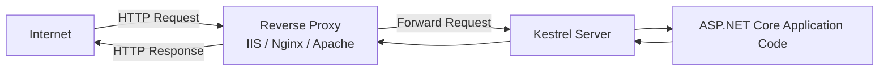

# Kestrel and Other Servers

**Application Server**
- Handles the actual ASP.NET Core application
- Example: **Kestrel**

**Reverse Proxy Servers**
- Sit in front of the application server
- Handle security, SSL, load balancing

Examples:
- **IIS**
- **Nginx**
- **Apache**

### Interview One-Liner
> In ASP.NET Core, **Kestrel is the application server**, and it is usually hosted behind **reverse proxy servers like IIS, Nginx, or Apache**.

---

1️⃣ Direct Request to Kestrel (Simple Hosting)

Flow

1. Client sends request from Internet

2. Request reaches Kestrel Server

3. Kestrel forwards request to ASP.NET Core Application

4. Application processes request

5. Response returns through Kestrel → Internet

2️⃣ Production Setup (Reverse Proxy + Kestrel)

Flow

1. Client sends request from Internet

2. Request first goes to Reverse Proxy (IIS / Nginx / Apache)

3. Proxy forwards request to Kestrel

4. Kestrel sends request to ASP.NET Core App

5. App processes request

6. Response returns App → Kestrel → Reverse Proxy → Client

## Benefits of Reverse Proxy Servers

1. Load Balancing
2. Caching
3. URL Rewriting
4. Decompressing the requests
5. Authentication
6. Decryption of SSSL Certificates

Both IIS Express and actual IIS both are supported by Windows operating
system only.

Nginx, Apache are supported by Linux mainly and Windows as well.

So this is the overview of the servers that we are going to use in ASP.NET Core applications.

See, by default, when you try to run this application, it automatically opens up the browser such as Chrome or Firefox, whatever default browser on your machine and sends the request.

And our application receives that request and provides the response that is hello world.

This is the common process.

But before this thing happens, means before the browser can send request,
internally on the terminal, the Kestrel server has been opened.

You can see that here.See in background, this type of window has been opened.

So this terminal window indicates the Kestrel server.