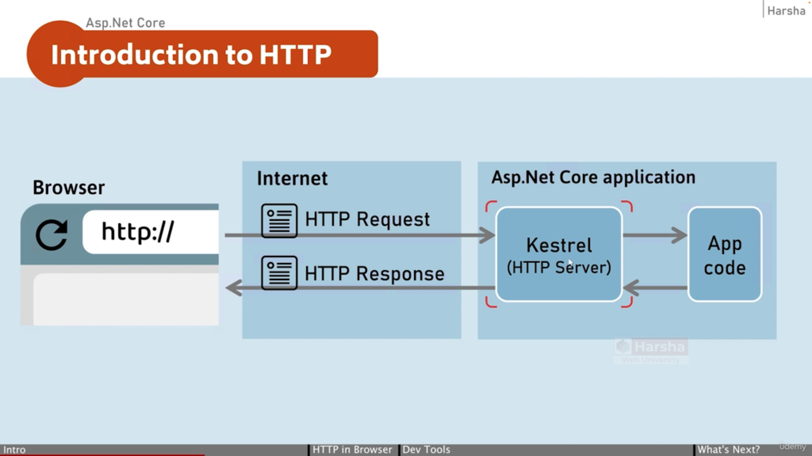

# Introduction to HTTP

## HTTP is an application-protocol that defines set of rules to send request from browser to server and send response from server to browser.

---

## HTTP - Hyper Text Transfer Protocol

* Initially developed by Tim Berners Lee, later standardized by IETF (Internet Engineering Task Force) and W3C (World Wide Web Consortium).

* All the websites on internet use HTTP protocol with or without SSL, means security socket layer.HTTP protocol with SSL certificates are called as HTTPS protocol, which is basically HTTP protocol with a security layer.

* SSL - Security Socket Layer.

