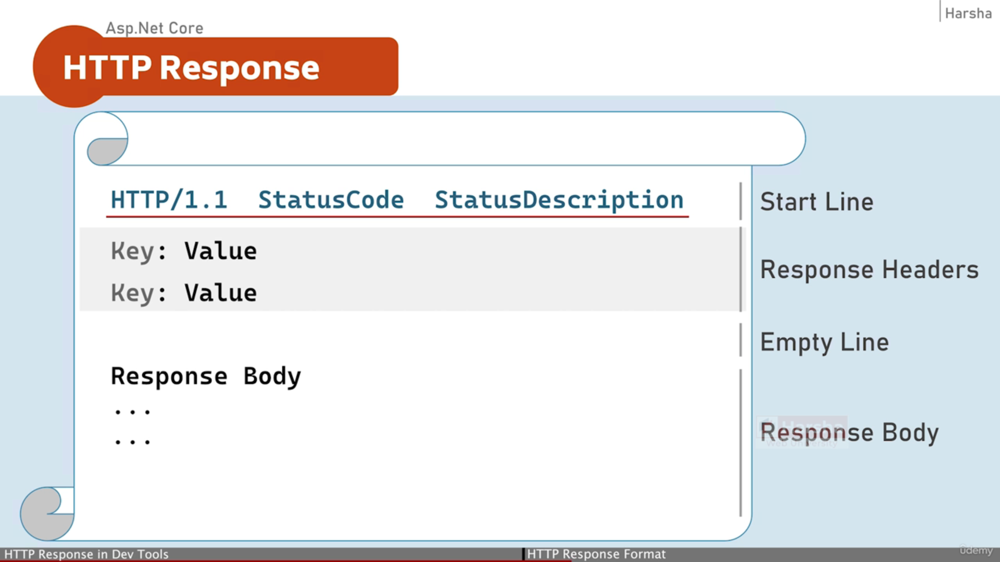
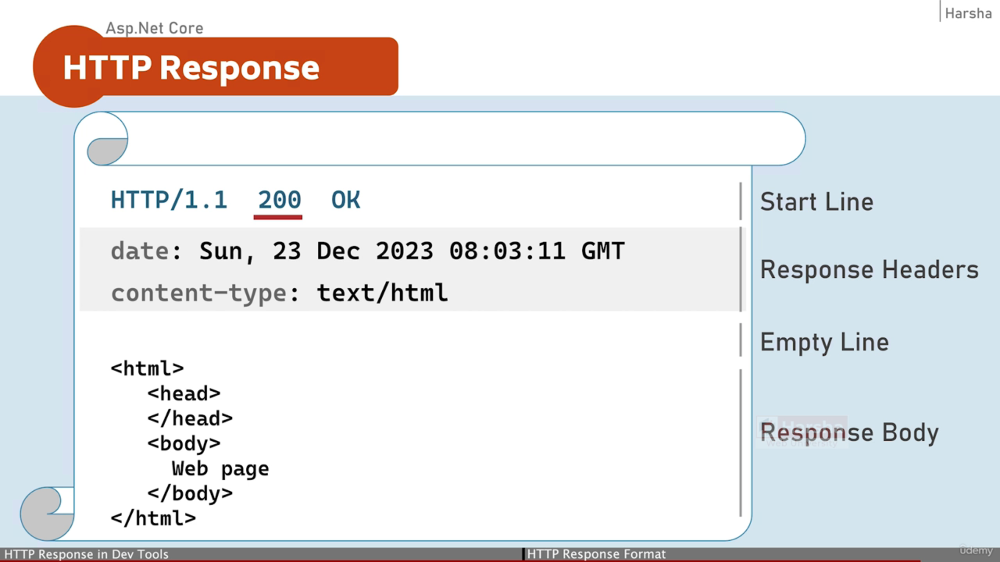
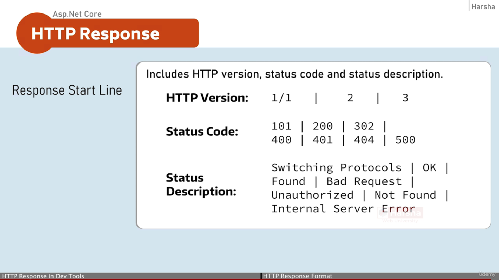

## HTTP Response



Example Response Headers

```javascript
HTTP/1.1 200 OK
Content-Type: text/plain; charset=utf-8
Date: Sun, 15 Mar 2026 14:55:06 GMT
Server: Kestrel
Transfer-Encoding: chunked
```



## Important Status Codes



# ASP.NET Core — HTTP Response

## Response Start Line

The **Response Start Line** includes:

* **HTTP Version**
* **Status Code**
* **Status Description**

---

### HTTP Version

```
1.1 | 2 | 3
```

---

### Status Code

```
101 | 200 | 302
400 | 401 | 404 | 500
```

---

### Status Description

```
101 → Switching Protocols
200 → OK
302 → Found
400 → Bad Request
401 → Unauthorized
404 → Not Found
500 → Internal Server Error
```
