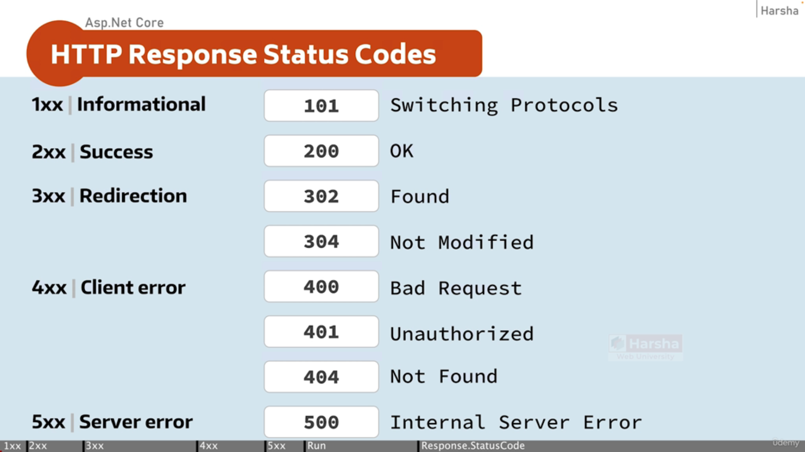

## Http Status Codes



# ASP.NET Core — HTTP Response Status Codes

## 1xx | Informational

For example switching from http protocol to https

```
101 → Switching Protocols
```

---

## 2xx | Success

```
200 → OK
```

---

## 3xx | Redirection

Url - /view-courses  the url is found and redirected to another url - /courses/view  - 302

```
302 → Found
304 → Not Modified
```

---

## 4xx | Client Error

```
400 → Bad Request
401 → Unauthorized
404 → Not Found
```

---

## 5xx | Server Error

```
500 → Internal Server Error
```
